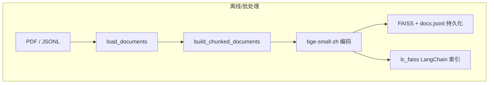
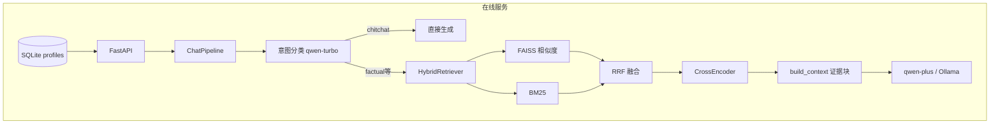

## 1. 项目介绍

**电商售前场景的问答系统**：从 PDF / JSONL 知识库构建向量+稀疏混合索引，用户提问经**意图路由**后，对事实类问题做**混合检索 + 重排序**，再把证据注入 Prompt，由 **DashScope（通义）或 Ollama** 生成回答；支持**用户画像、多轮指代、流式输出**，并通过 **FastAPI + Gradio** 对外服务。

---

## 2. 业务与产品形态

| 维度  | 说明                                                       |
| --- | -------------------------------------------------------- |
| 场景  | 售前咨询：参数、对比、政策、操作步骤等                                      |
| 用户侧 | Gradio：「智能客服」导购口吻 / 「研发调试」报告式 + 证据与 trace                |
| 服务端 | FastAPI：`/ask`、`/ask/stream`、画像 CRUD `/profiles`         |
| 画像  | SQLite 存预算/偏好/需求，请求可带 `profile_id` 或与表单合并进 system prompt |

---

## 3. 技术栈总览（All-in-RAG  checklist）

| 层次    | 技术                                                                                                     |
| ----- | ------------------------------------------------------------------------------------------------------ |
| 解析与入库 | MinerU（本地 `magic-pdf` 或云端 precision/flash）、多 `source_type`（jsonl / mineru_markdown / mineru_langchain） |
| 切分    | Recursive 等策略，`chunk_size` / `chunk_overlap` 可配                                                        |
| 向量化   | `BAAI/bge-small-zh-v1.5`（中英、体量小，适合中文售前）                                                                |
| 向量库   | LangChain `FAISS` 落盘 `data/index/lc_faiss/`                                                            |
| 稀疏检索  | BM25（`langchain_community`，语料来自 `docs.jsonl`）                                                          |
| 融合    | **RRF（Reciprocal Rank Fusion）**，按 `doc_id` 去重加权                                                        |
| 重排序   | CrossEncoder `BAAI/bge-reranker-base`                                                                  |
| 生成    | DashScope OpenAI 兼容接口（`qwen-plus`）或 Ollama                                                             |
| 意图    | 小模型 `qwen-turbo` 输出结构化 JSON，分支 **闲聊不走检索**                                                              |
| 编排    | 自研 `ChatPipeline` + LangChain 组件（向量库、BM25）                                                             |
| 观测    | `retrieval_debug`、分阶段耗时、trace_id                                                                       |

---

## 4. 系统架构

---

## 5. 数据与索引流水线

**入口**：`src/ingestion/build_indexes.py` → `build_and_save_indexes`。

1. **加载**：`load_documents` 按 `source_type` 读 JSONL 或 MinerU 产物（Markdown 等）。
2. **可选 MinerU 批跑**：`mineru_auto_run` 时对 `data/mineru_input` 跑解析，输出到 `mineru_output_dir`。
3. **切分**：`build_chunked_documents`，控制粒度与重叠，影响召回与上下文长度。
4. **双写索引**：
  - `persist_index`：`dense.npy`、`dense.faiss`、`docs.jsonl`（BM25 与调试用）。
  - `persist_langchain_index`：`lc_faiss/` 供运行时 `FAISS.load_local`。
5. **清单**：`index_manifest.json` 记录 chunk 数、模型、切分参数等。

**运维要点**：`configs/settings.yaml` 中 `ingestion.build_on_startup: false` 时，API **启动不重建索引**，避免每次重启全量嵌入；更新知识库可跑 `scripts/run_mineru_pipeline.py` 或临时打开 `build_on_startup`。
